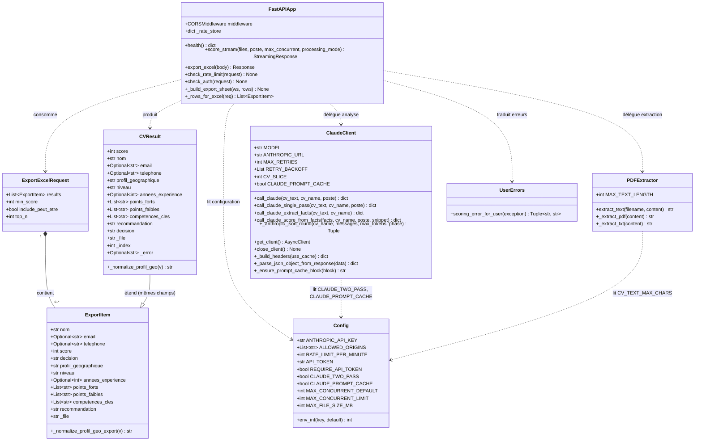
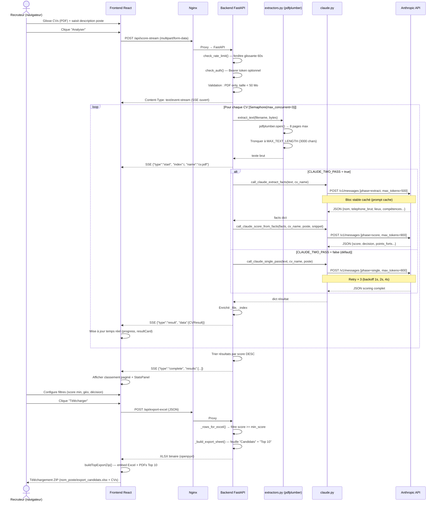
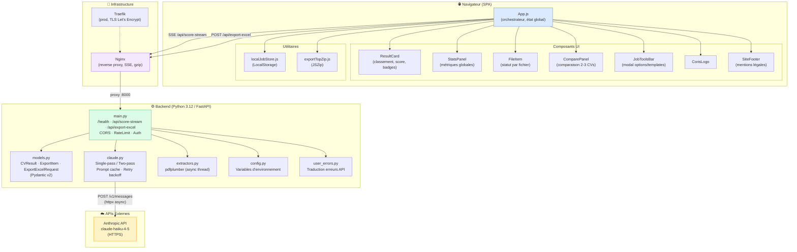
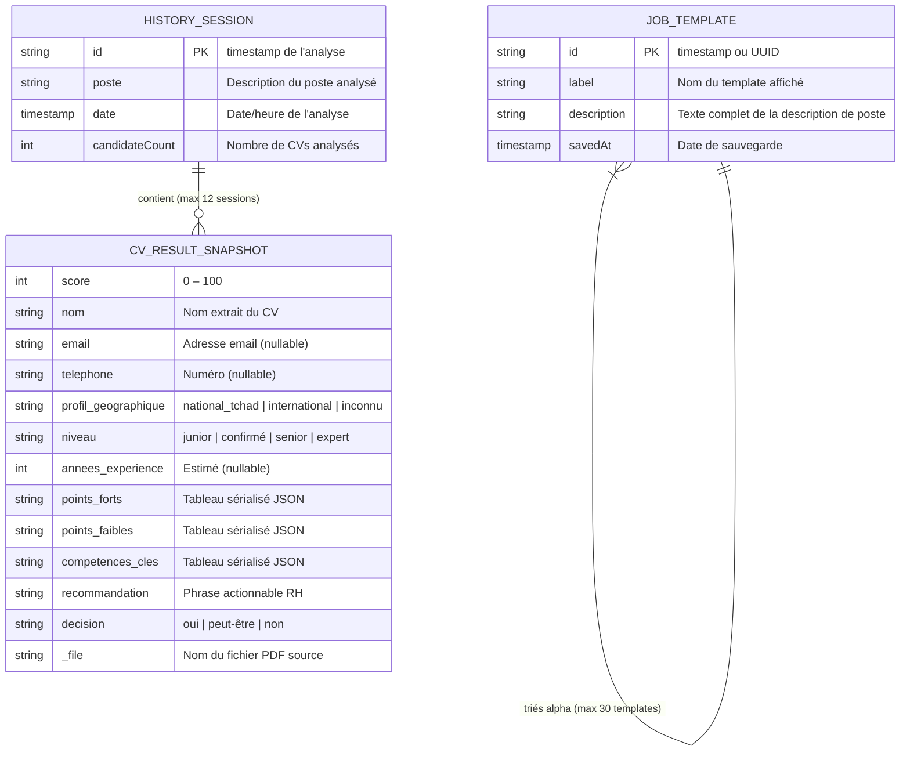

# Présentation Technique — CV Scorer

> Générée le 2026-04-27 | Basée sur l'analyse complète du dépôt `cv-scorer`

---

## Table des matières

1. [Vue d'ensemble du projet](#1-vue-densemble-du-projet)
2. [Structure du projet](#2-structure-du-projet)
3. [Diagrammes UML](#3-diagrammes-uml)
   - [a. Diagramme de classes](#a-diagramme-de-classes)
   - [b. Diagramme de séquence](#b-diagramme-de-séquence)
   - [c. Diagramme de composants](#c-diagramme-de-composants)
   - [d. Persistance locale (LocalStorage)](#d-persistance-locale--localstorage)
4. [Analyse des flux de données](#4-analyse-des-flux-de-données)
5. [Points d'attention](#5-points-dattention)
6. [Résumé exécutif](#6-résumé-exécutif)

---

## 1. Vue d'ensemble du projet

### Nom et objectif

**CV Scorer** est une application web de présélection RH assistée par intelligence artificielle, développée pour **Coris Bank International**. Elle permet à un recruteur de soumettre un lot de CVs en PDF et une description de poste, puis d'obtenir automatiquement un classement des candidats avec score, décision, points forts/faibles et recommandation — le tout via l'API Claude (Anthropic).

### Domaine fonctionnel

Ressources Humaines · Recrutement · IA générative · Traitement documentaire

### Stack technique détaillée

| Couche | Technologie | Version |
|---|---|---|
| Frontend | React | 18.3 |
| Frontend — upload | react-dropzone | — |
| Frontend — archive | JSZip | 3.10.1 |
| Backend | Python | 3.12 |
| Backend — API | FastAPI | 0.115.0 |
| Backend — serveur ASGI | Uvicorn | 0.30.6 |
| Backend — client HTTP | httpx | (async) |
| Backend — validation | Pydantic v2 | — |
| IA | Anthropic Claude Haiku | `claude-haiku-4-5` |
| Extraction PDF | pdfplumber | 0.11.4 |
| Export Excel | openpyxl | 3.1.5 |
| Proxy / Reverse proxy (dev) | Nginx | Alpine |
| Proxy / TLS (prod) | Traefik | v3.0 |
| Conteneurisation | Docker Compose | — |
| Tests | pytest + pytest-asyncio | 8.3.3 / 0.24.0 |
| CI | GitHub Actions | — |

### Architecture générale

L'application suit un modèle **frontend-backend découplé** avec rendu côté client (SPA React) et API REST/SSE FastAPI. Il n'existe pas de base de données : le système est **stateless** côté serveur — les résultats sont éphémères en mémoire et la persistance légère (templates, historique) est gérée en **LocalStorage navigateur**.

```
┌──────────────────────────────────────────────────────────┐
│                     NAVIGATEUR (SPA)                      │
│  React 18 + react-dropzone + JSZip + LocalStorage         │
└─────────────────────┬────────────────────────────────────┘
                      │ HTTP / Server-Sent Events
                ┌─────▼──────┐
                │   Nginx    │  ← reverse proxy + gzip + SSE
                └──┬──────┬──┘
         ┌─────────┘      └─────────┐
    ┌────▼──────┐          ┌────────▼────────┐
    │  Frontend  │          │  Backend API    │
    │  (static)  │          │  FastAPI/Python │
    └────────────┘          └────────┬────────┘
                                     │
                         ┌───────────▼───────────┐
                         │   Anthropic Claude API │
                         │   (claude-haiku-4-5)   │
                         └────────────────────────┘
```

En production, Traefik remplace Nginx en frontal et gère le TLS Let's Encrypt.

### Points d'entrée de l'application

| Environnement | Point d'entrée | Port |
|---|---|---|
| Développement | `docker-compose up` | 80 |
| Production | `docker-compose -f docker-compose.prod.yml up` | 443 (HTTPS) |
| Backend seul | `uvicorn main:app --host 0.0.0.0 --port 8000` | 8000 |
| Frontend seul | `npm start` (dans `frontend/`) | 3000 |
| API de santé | `GET /health` | — |

---

## 2. Structure du projet

```
cv-scorer/
│
├── backend/                        ← Service Python / FastAPI
│   ├── main.py                     ← Application FastAPI, endpoints, export Excel
│   ├── models.py                   ← Modèles Pydantic (CVResult, ExportItem, ExportExcelRequest)
│   ├── claude.py                   ← Intégration Anthropic API (single-pass / two-pass, cache)
│   ├── extractors.py               ← Extraction texte PDF via pdfplumber
│   ├── config.py                   ← Variables d'environnement, configuration globale
│   ├── user_errors.py              ← Traduction des erreurs API Claude en messages utilisateur
│   ├── requirements.txt            ← Dépendances Python
│   ├── Dockerfile                  ← Image Python 3.12-slim, Uvicorn
│   └── tests/
│       ├── test_api.py             ← Tests endpoints FastAPI
│       ├── test_claude.py          ← Tests intégration Claude
│       ├── test_extractors.py      ← Tests extraction PDF
│       └── test_user_errors.py     ← Tests messages d'erreur
│
├── frontend/                       ← Application React (SPA)
│   ├── src/
│   │   ├── App.js                  ← Composant racine, orchestration, state global
│   │   ├── styles.css              ← Design system Coris Bank (couleurs, layout)
│   │   ├── index.js                ← Point d'entrée React DOM
│   │   ├── components/
│   │   │   ├── ResultCard.js       ← Carte candidat (score, décision, badges, détails)
│   │   │   ├── StatsPanel.js       ← Métriques agrégées (total, à contacter, moyenne)
│   │   │   ├── FileItem.js         ← Ligne fichier avec statut en temps réel
│   │   │   ├── JobToolsBar.js      ← Modal options (templates, seuils, mode traitement)
│   │   │   ├── ComparePanel.js     ← Comparaison côte-à-côte de 2-3 candidats
│   │   │   ├── CorisLogo.js        ← Logo Coris Bank International
│   │   │   └── SiteFooter.js       ← Pied de page légal et conservation des données
│   │   └── utils/
│   │       ├── localJobStore.js    ← Persistance LocalStorage (templates, historique)
│   │       └── exportTopZip.js     ← Création archive ZIP (Excel + PDFs Top 10)
│   ├── public/                     ← Fichiers statiques HTML
│   ├── package.json                ← Dépendances Node.js
│   ├── Dockerfile                  ← Build multi-étapes : Node builder → Nginx
│   └── nginx.conf                  ← Config Nginx frontend (gzip, cache, SPA fallback)
│
├── nginx/
│   └── default.conf                ← Config Nginx reverse proxy (SSE, timeouts, CORS)
│
├── docker-compose.yml              ← Environnement développement (port 80)
├── docker-compose.prod.yml         ← Production Traefik + Let's Encrypt
├── .env.example                    ← Modèle de variables d'environnement
├── .github/
│   └── workflows/ci.yml            ← Pipeline CI GitHub Actions (tests pytest)
└── TECHNICAL_OVERVIEW.md           ← Ce document
```

### Rôle de chaque couche

| Couche | Responsabilité |
|---|---|
| `backend/main.py` | Routage HTTP, middleware CORS/auth/rate-limit, streaming SSE, génération Excel |
| `backend/models.py` | Schémas de données validés (Pydantic v2), normalisation profil géographique |
| `backend/claude.py` | Appels Anthropic API, deux modes d'analyse, cache de prompt, retry avec backoff |
| `backend/extractors.py` | Extraction de texte PDF (thread séparé, 8 pages max, 3 000 caractères max) |
| `backend/config.py` | Centralisation de la configuration par variables d'environnement |
| `backend/user_errors.py` | Traduction des erreurs techniques Claude en messages RH compréhensibles |
| `frontend/src/App.js` | État global React, consommation SSE, filtres, export, pagination |
| `frontend/src/components/` | Composants UI réutilisables (affichage, interactions) |
| `frontend/src/utils/` | Logique métier frontend (persistance locale, création ZIP) |
| `nginx/default.conf` | Reverse proxy : routing, buffering SSE désactivé, timeouts longs |

---

## 3. Diagrammes UML

### a. Diagramme de classes



### b. Diagramme de séquence

Flux principal : **analyse d'un lot de CVs de bout en bout**



### c. Diagramme de composants



### d. Persistance locale — LocalStorage

> L'application ne dispose pas de base de données relationnelle. Toute la persistance s'effectue côté navigateur via le `LocalStorage`.



**Cardinalités réelles :**
- `JOB_TEMPLATE` : maximum 30 entrées (rotation FIFO)
- `HISTORY_SESSION` : maximum 12 sessions (rotation FIFO)
- `CV_RESULT_SNAPSHOT` : illimité par session (autant de CVs qu'analysés)

---

## 4. Analyse des flux de données

### 4.1 Flux entrant — Ingestion des CVs

```
Utilisateur
  │
  ▼ Glisser-déposer ou sélection fichier (react-dropzone)
Validation client-side
  ├─ Extension : .pdf uniquement
  ├─ Taille : < 50 Mo
  └─ Dédoublonnage par nom de fichier
  │
  ▼ FormData multipart (PDF bytes + description poste)
POST /api/score-stream
  │
  ▼ Validation serveur
  ├─ Extension .pdf (vérification finale)
  ├─ Taille bytes > MAX_FILE_SIZE_MB → HTTP 400
  └─ Poste vide → HTTP 400
  │
  ▼ extract_text() — asyncio.to_thread (non-bloquant)
  ├─ pdfplumber.open(BytesIO(content))
  ├─ Pages 1–8 uniquement
  ├─ Concaténation texte brut
  └─ Tronquer à 3 000 caractères (CV_TEXT_MAX_CHARS)
```

### 4.2 Flux de traitement — Analyse IA

```
Texte CV (≤ 3000 chars) + Description poste
  │
  ├─── [CLAUDE_TWO_PASS = false, défaut]
  │       call_claude_single_pass()
  │       └─ Prompt : instructions stables (cachées) + poste + CV
  │          → JSON : score, nom, email, téléphone, niveau,
  │                   annees_experience, points_forts, points_faibles,
  │                   competences_cles, recommandation,
  │                   profil_geographique, decision
  │
  └─── [CLAUDE_TWO_PASS = true]
          Passe 1 — call_claude_extract_facts()
          └─ JSON facts : nom_detecte, telephone_brut,
                          lieu_derniere_experience, lieu_travail_actuel,
                          annees_experience_estime, diplomes, postes_cles,
                          competences_liste, outils_ou_logiciels, langues, secteurs
          │
          Passe 2 — call_claude_score_from_facts()
          └─ JSON scoring (identique au single-pass)
              + croisement téléphone/lieu → profil_geographique

Retry logic (× 3) :
  ├─ HTTP 429 (rate limit Anthropic) → wait 1s / 2s / 4s
  ├─ HTTP 5xx (erreur serveur Anthropic) → même backoff
  ├─ ConnectError / ReadTimeout → même backoff
  └─ Prompt cache rejeté (HTTP 400 avec marker) → repli sans cache
```

### 4.3 Flux sortant — Résultats et export

```
Résultats (dict Python)
  │
  ├─ Via SSE stream temps réel
  │   ├─ event "start"    → signal d'avancement par fichier
  │   ├─ event "result"   → CVResult JSON complet
  │   ├─ event "error"    → erreur fichier (sans interrompre les autres)
  │   └─ event "complete" → tous résultats triés score DESC
  │
  └─ Via POST /api/export-excel
      ├─ Filtre : score >= min_score (toutes décisions)
      ├─ Tri : score décroissant
      ├─ Feuille "Candidats" : tous les candidats filtrés
      ├─ Feuille "Top 10" : top_n premiers
      ├─ Mise en forme : alternance de lignes, auto-filter Excel,
      │   largeurs de colonnes, polices, bordures
      └─ Réponse : XLSX binaire (Content-Disposition: attachment)

Frontend (buildTopExportZip) :
  ├─ Reçoit XLSX
  ├─ Construit dossier ZIP sanitizé :
  │   nom_poste/ (nom de poste en titre)
  │   ├─ export_candidats.xlsx
  │   ├─ 01_CandidatNom.pdf
  │   ├─ 02_AutreCandidatNom.pdf
  │   └─ ... (10 premiers)
  └─ Déclenche téléchargement navigateur
```

### 4.4 Couche de persistance

| Type | Mécanisme | Durée de vie | Limite |
|---|---|---|---|
| Résultats d'analyse | Mémoire JavaScript (state React) | Session navigateur | Illimitée |
| Templates de postes | `localStorage` (`cv_scorer_jobs`) | Permanent (manuel) | 30 templates |
| Historique d'analyses | `localStorage` (`cv_scorer_history`) | Permanent (FIFO) | 12 sessions |
| Fichiers PDF | Mémoire navigateur (File objects) | Session navigateur | — |
| Données serveur | Aucune (stateless) | — | — |

---

## 5. Points d'attention

### 5.1 Dette technique détectée

| # | Observation | Impact | Priorité |
|---|---|---|---|
| 1 | **Worker Uvicorn unique** : `--workers 1` imposé pour le streaming SSE (état partagé). Pas de scalabilité horizontale native. | Limite le débit concurrent | Moyen |
| 2 | **Pas de base de données** : l'historique et les templates ne sont stockés que dans le navigateur de l'utilisateur (LocalStorage). Perte si changement de navigateur ou effacement. | Perte de données | Faible-Moyen |
| 3 | **Rate limiting en mémoire** (`_rate_store` dict) : remis à zéro au redémarrage du serveur, non distribué en cas de plusieurs instances. | Inefficace en prod multi-instance | Moyen |
| 4 | **`@app.on_event("startup"/"shutdown")` dépréciés** : FastAPI recommande désormais `lifespan` context manager depuis la version 0.93. | Deprecation warnings | Faible |
| 5 | **Pas de validation du Content-Type** des fichiers uploadés (seulement l'extension `.pdf`). Un fichier malveillant renommé en `.pdf` passerait. | Sécurité marginale | Faible |
| 6 | **Client httpx partagé** (singleton `_client`) sans pool de connexions configuré explicitement. | Latence en charge élevée | Faible |
| 7 | **LocalStorage non chiffré** : les données de CV analysées (noms, emails, téléphones de candidats) persistent en clair dans le navigateur. | Conformité RGPD | Moyen |
| 8 | **Token API en variable d'environnement React** (`REACT_APP_API_TOKEN`) : embarqué dans le bundle JS distribué au navigateur et donc visible en source. | Sécurité token | Moyen |

### 5.2 Patterns utilisés

| Pattern | Où | Description |
|---|---|---|
| **Singleton** | `claude.py` — `_client` httpx | Une seule instance du client HTTP partagée |
| **Strategy** | `claude.py` — `call_claude()` | Sélection dynamique single-pass ou two-pass |
| **Producer-Consumer** | `main.py` — `output_queue` asyncio | Queue asynchrone entre tâches de traitement et générateur SSE |
| **Builder** | `main.py` — `_build_export_sheet()` | Construction incrémentale du fichier Excel |
| **Façade** | `claude.py` — `call_claude()` | Point d'entrée unique masquant la complexité des deux passes |
| **Retry with Backoff** | `claude.py` — `_anthropic_json_round()` | Résilience face aux erreurs transitoires de l'API |
| **Decorator (dépendances)** | `main.py` — `Depends(check_auth)` | Injection de dépendances FastAPI pour auth/rate-limit |
| **Event-Driven (SSE)** | Frontend/Backend | Mise à jour UI réactive sans polling |

### 5.3 Axes d'amélioration

1. **Scalabilité** : Migrer vers un bus de messages (Redis Pub/Sub, RabbitMQ) pour permettre plusieurs workers Uvicorn tout en conservant le streaming SSE.
2. **Persistance serveur** : Ajouter une base de données légère (SQLite ou PostgreSQL) pour stocker les analyses et permettre la consultation différée des résultats.
3. **Authentification robuste** : Remplacer le token statique par OAuth2/JWT ou intégration LDAP (adapté au contexte bancaire Coris Bank).
4. **Validation MIME** : Utiliser `python-magic` pour valider le type réel des fichiers uploadés (pas seulement l'extension).
5. **Rate limiting distribué** : Passer à Redis-backed rate limiting (ex. `fastapi-limiter`) pour la production multi-instance.
6. **Audit RGPD** : Chiffrer ou ne pas persister les coordonnées personnelles dans le LocalStorage ; ajouter une politique de rétention explicite.
7. **Tests d'intégration** : Les tests actuels n'exercent pas le flux SSE complet ; ajouter des tests `httpx.AsyncClient` avec streaming.
8. **Observabilité** : Structurer les logs (JSON), ajouter des métriques Prometheus et des traces OpenTelemetry.

---

## 6. Résumé exécutif

### Tableau récapitulatif : technologie → rôle → fichiers

| Technologie | Rôle dans le système | Fichiers principaux |
|---|---|---|
| **React 18.3** | Interface utilisateur SPA, gestion état global, streaming SSE | `frontend/src/App.js`, `styles.css` |
| **react-dropzone** | Glisser-déposer de fichiers PDF | `App.js` |
| **JSZip** | Création archive ZIP (Excel + PDFs) | `frontend/src/utils/exportTopZip.js` |
| **LocalStorage API** | Persistance templates et historique navigateur | `frontend/src/utils/localJobStore.js` |
| **FastAPI 0.115** | API REST + streaming SSE, middleware, validation | `backend/main.py` |
| **Pydantic v2** | Validation et sérialisation des modèles de données | `backend/models.py` |
| **httpx (async)** | Client HTTP non-bloquant vers Anthropic API | `backend/claude.py` |
| **Anthropic Claude Haiku** | Analyse IA des CVs, scoring, extraction d'informations | `backend/claude.py` |
| **pdfplumber** | Extraction de texte depuis fichiers PDF | `backend/extractors.py` |
| **openpyxl** | Génération de fichiers Excel formatés (XLSX) | `backend/main.py` |
| **Nginx** | Reverse proxy, désactivation buffering SSE, gzip | `nginx/default.conf`, `frontend/nginx.conf` |
| **Traefik v3** | Reverse proxy production, TLS automatique Let's Encrypt | `docker-compose.prod.yml` |
| **Docker Compose** | Orchestration multi-conteneurs (dev et prod) | `docker-compose.yml`, `docker-compose.prod.yml` |
| **pytest** | Tests unitaires et d'intégration backend | `backend/tests/` |
| **GitHub Actions** | Pipeline CI (linting, tests) | `.github/workflows/ci.yml` |

### Forces de l'architecture

| Force | Description |
|---|---|
| **Streaming temps réel** | L'analyse SSE permet un retour visuel immédiat candidat par candidat, sans attendre la fin du lot |
| **Traitement parallèle** | Le `Semaphore` asyncio permet d'analyser plusieurs CVs simultanément, réduisant le temps total |
| **Optimisation des coûts IA** | Le prompt caching réduit ~50% des tokens d'entrée en réutilisant les instructions stables |
| **Déploiement simplifié** | Docker Compose garantit une reproductibilité totale entre dev et prod |
| **Stateless côté serveur** | Aucune dépendance à une base de données, simplifie les déploiements et la maintenance |
| **Résilience** | Retry avec backoff exponentiel et repli sans cache garantissent la robustesse face aux erreurs Anthropic |
| **Flexibilité d'analyse** | Le mode two-pass (optionnel) améliore la qualité sur les CVs complexes |

### Limites de l'architecture actuelle

| Limite | Description |
|---|---|
| **Non-scalable horizontalement** | Le worker unique Uvicorn bloque la réplication du backend (SSE en mémoire partagée) |
| **Pas de persistance serveur** | Les résultats d'analyse sont perdus en cas de fermeture ou rechargement — pas d'ATS intégré |
| **Données sensibles en LocalStorage** | Coordonnées personnelles (RGPD) non chiffrées dans le navigateur |
| **Token embarqué dans le bundle** | `REACT_APP_API_TOKEN` visible dans le code source JavaScript distribué |
| **Dépendance totale Anthropic** | Toute indisponibilité de l'API Claude interrompt complètement le service |
| **Heuristique géographique** | La détection du profil géographique repose sur des heuristiques (indicatifs téléphoniques, mots-clés) — pas de geocoding |

---

*Document généré automatiquement par analyse statique du code source — cv-scorer v2.0.0*
